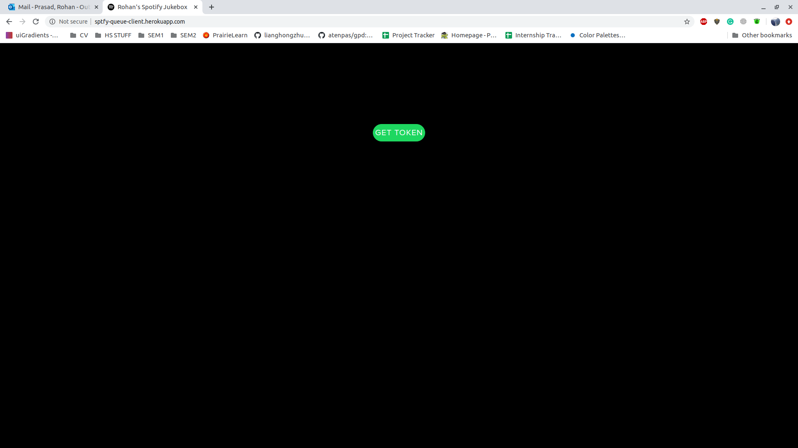
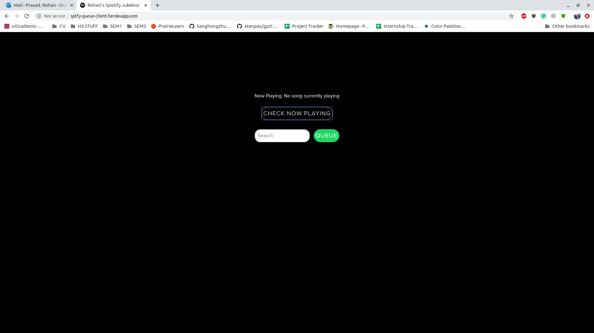
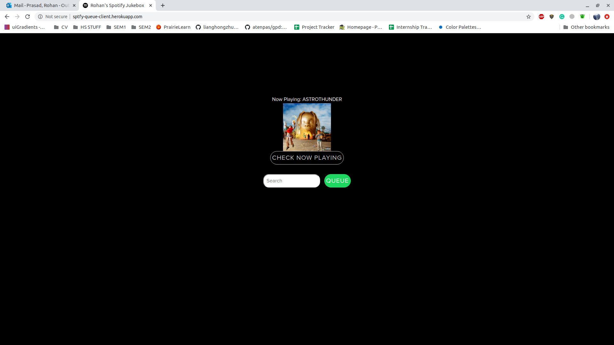
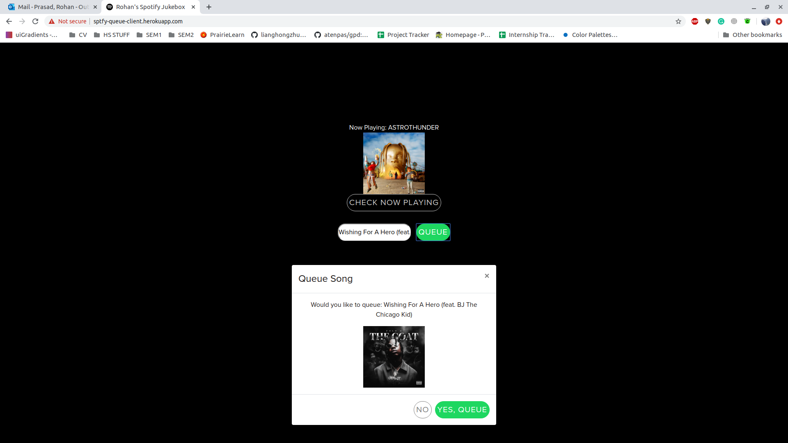
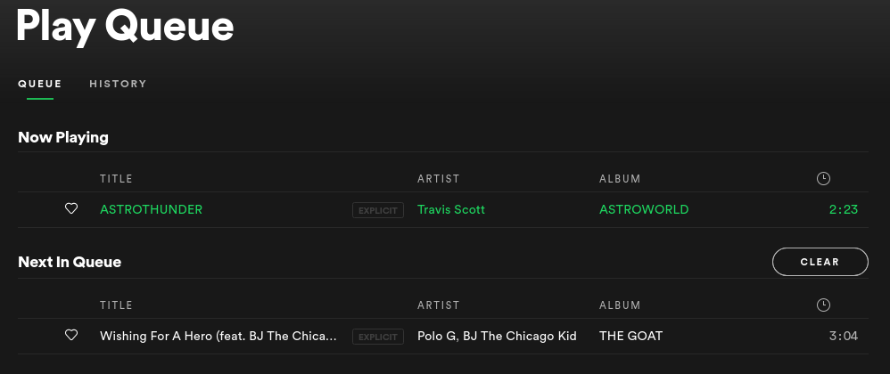

## Spotify Jukebox

This project was created  to enable song-queueing from any device through a web application. If you're looking for the corresponding [API](https://github.com/rohanp9000/spotify-queue-api) or [Authorization Server](https://github.com/rohanp9000/spotify-auth-server), those can be found at their respective hyperlinks.

> What I used

- [Spotify Web API](https://developer.spotify.com/documentation/web-api/)
- [Create React App](https://github.com/facebook/create-react-app)
- [Express](https://expressjs.com/)
- [Reach Router](https://reach.tech/router)
- [Styled Components](https://www.styled-components.com/)
- [Heroku](https://heroku.com)

This project was built with React and the Spotify API, using higher order components and styled components to somewhat mimic the UI/UX of spotify's music player.

Due to Spotify's API only allowing browser-based user authentication (and not through credentials), I wanted to avoid having to log into a singular spotify account on multiple devices to queue songs (i.e. logging into my spotify on my friends' phones). So, I wrote a backend that automatically refreshes an access token to my spotify account, and populates a database, which we're able to access from the front-end to access the queue, and request a song. You can read more about the back-end [here](https://github.com/rohanp9000/spotify-queue-api).

The front-end requires a user to grab the token from the API (because it changes every hour), and then lets them enter the queue-ing portal. The flow looks something like this:

---
## Once the user navigates to the queue-ing site:  

## Once the user succesfully recieves a token from the API:

## User checks for song playing, but nothing is playing:

## User checks for song playing, and song is playing:

## The user is able to queue a song:

## And just like that, it's been added to the queue!

---